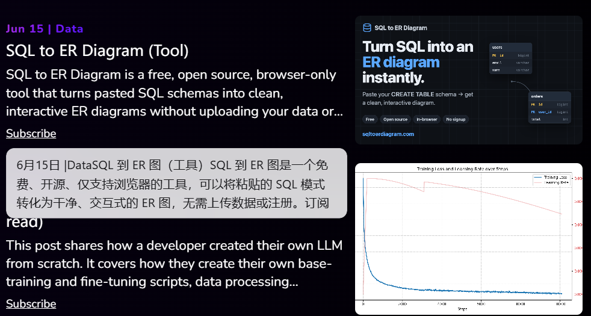
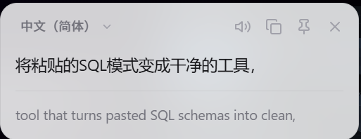

<div align="center">
  

  <h1>划词翻译卡片</h1>

  <p><strong>Select to Translate · 选中文字，就在原地弹出翻译卡片</strong></p>

  <p>
    
    
    
    
  </p>

  <p>
    不跳转、不打断阅读。支持拖动、钉住、多卡片对照、悬停阅读透镜、DeepL、Google、微软翻译和 OpenAI 兼容接口。
  </p>
</div>

## 预览

| 悬停阅读透镜 | 翻译卡片 |
| --- | --- |
|  |  |

## 为什么好用

- **原地翻译**：选中网页文字后，翻译按钮出现在选区末尾，点一下就在当前位置打开卡片。
- **可拖动、可钉住、可多开**：把卡片放到任意位置；钉住后继续划词会打开新卡片，适合多段内容对照。
- **悬停阅读透镜**：鼠标划过段落即可展开译文卡片，自动跳过按钮、菜单、导航和已经是目标语言的内容。
- **上下文翻译**：使用大模型引擎时，可连同段落上下文一起发送，减少一词多义造成的误译。
- **多引擎可选**：默认微软翻译，无需 Key；也支持 Google、DeepL、OpenAI、OpenRouter、本地 Ollama 或自定义兼容接口。
- **不污染网页**：卡片通过 Shadow DOM 渲染，样式和网页隔离。
- **顺手的细节**：复制译文、朗读译文、显示原文、深色模式、快捷键和右键菜单都已内置。

## 快速安装

适用于 Chrome / Edge 等 Chromium 内核浏览器，扩展使用 Manifest V3。

### 下载 Release

1. 打开 [Releases](https://github.com/zuoqiumama/translator-browser-plugin/releases)，下载最新的 `translator-browser-plugin-vX.Y.Z.zip`。
2. 解压到一个固定文件夹。浏览器加载的是这个文件夹，删除后扩展会失效。
3. 打开扩展管理页：
   - Chrome：`chrome://extensions`
   - Edge：`edge://extensions`
4. 开启右上角 **开发者模式 / Developer mode**。
5. 点击 **加载已解压的扩展程序 / Load unpacked**，选择刚解压出来且包含 `manifest.json` 的文件夹。
6. 建议把扩展图标固定到浏览器工具栏，方便切换设置。

### 从源码加载

```bash
git clone https://github.com/zuoqiumama/translator-browser-plugin.git
```

然后打开 `chrome://extensions`，开启开发者模式，点击 **加载已解压的扩展程序**，选择 clone 下来的项目目录。

更新代码后，在扩展管理页点击该扩展的「刷新」即可重新加载；如果改动影响内容脚本，还需要刷新目标网页。

## 使用方式

| 操作 | 效果 |
| --- | --- |
| 选中文字 | 在选区末尾显示翻译按钮，点击后弹出翻译卡片 |
| 选中即译 | 在设置中开启后，选中文字会直接翻译 |
| `Alt+T` | 翻译当前选中文字，可在 `chrome://extensions/shortcuts` 修改快捷键 |
| 右键菜单 | 选择「翻译选中文字」 |
| 拖动卡片顶部 | 将卡片移动到任意位置，位置会被记住 |
| 点击图钉 | 固定当前卡片；之后再划词会打开新卡片 |
| 切换目标语言 | 在卡片下拉框中选择语言并立即重译 |
| 复制 / 朗读 | 复制译文，或使用浏览器 TTS 朗读译文 |
| `Esc` / 关闭按钮 | 关闭当前活动卡片，或关闭单张卡片 |

工具栏弹窗可以快速切换目标语言、触发方式和翻译引擎；完整选项页用于配置 API Key、主题、朗读、原文显示、上下文翻译等高级设置。

## 翻译引擎

| 引擎 | 适合场景 | 备注 |
| --- | --- | --- |
| 微软翻译 | 开箱即用、国内直连 | 默认引擎，无需 API Key |
| Google | 免费轻量翻译 | 需要能访问 Google 服务 |
| DeepL | 更高质量的常规翻译 | 需要 DeepL API Key，支持 Free / Pro |
| OpenAI 兼容接口 | 上下文翻译、自定义模型 | 支持 OpenAI、OpenRouter、本地 Ollama 或自建接口 |

自定义 OpenAI 兼容接口可配置：

- `Base URL`：例如 `https://api.openai.com/v1`、`https://openrouter.ai/api/v1`、`http://localhost:11434/v1`
- `Model`：例如 `gpt-4o-mini`
- `API Key`：本地模型可留空

如果使用自定义域名，需要在选项页点击「授权该接口域名」授予浏览器访问权限。

## 隐私与安全

- 只有在你触发翻译时，扩展才会把选中的文字发送给所选翻译引擎。
- API Key 等配置保存在浏览器 `chrome.storage.sync` 中，不会上传到本项目或第三方统计服务。
- 项目不包含统计、埋点或追踪代码。
- 翻译请求统一由 Service Worker 发起，避免把 API Key 暴露到网页环境。
- 译文使用 `textContent` 写入卡片，不注入 HTML，降低 XSS 风险。

## 项目结构

```text
translate-card/
├─ manifest.json                 # MV3 扩展配置
├─ src/
│  ├─ data.js                    # 语言列表和默认设置
│  ├─ translators.js             # 各翻译引擎实现
│  ├─ background.js              # Service Worker、消息分发、菜单和快捷键
│  ├─ content-styles.js          # Shadow DOM 卡片样式
│  ├─ content.js                 # 划词检测、卡片 UI、拖动和关闭
│  ├─ popup.html / popup.js      # 工具栏弹窗
│  └─ options.html / options.js  # 完整设置页
├─ icons/                        # 扩展图标
├─ img/                          # README 截图
└─ tools/gen-icons.js            # 图标生成脚本
```

## 开发

重新生成图标：

```bash
node tools/gen-icons.js
```

加载开发版：

1. 在浏览器扩展管理页开启开发者模式。
2. 选择项目根目录作为「已解压的扩展程序」。
3. 修改代码后点击扩展卡片上的「刷新」。
4. 如果修改了 `src/content.js` 或 `src/content-styles.js`，同时刷新正在测试的网页。

## Firefox

项目逻辑遵循 Manifest V3。较新版 Firefox 支持 `background.service_worker`，但如需正式适配，可能还需要调整后台脚本声明和浏览器 API 差异。当前主力适配目标是 Chrome / Edge。

## 已知限制

- `chrome://`、扩展商店等浏览器特殊页面无法注入内容脚本。
- Google 免费接口为非官方端点，国内网络环境通常不可直连。
- 微软免费令牌有有效期，扩展会自动缓存并提前刷新。
- 极少数站点的严格 CSP 可能影响样式注入，扩展已优先使用 `adoptedStyleSheets` 并回退到 `<style>`。
